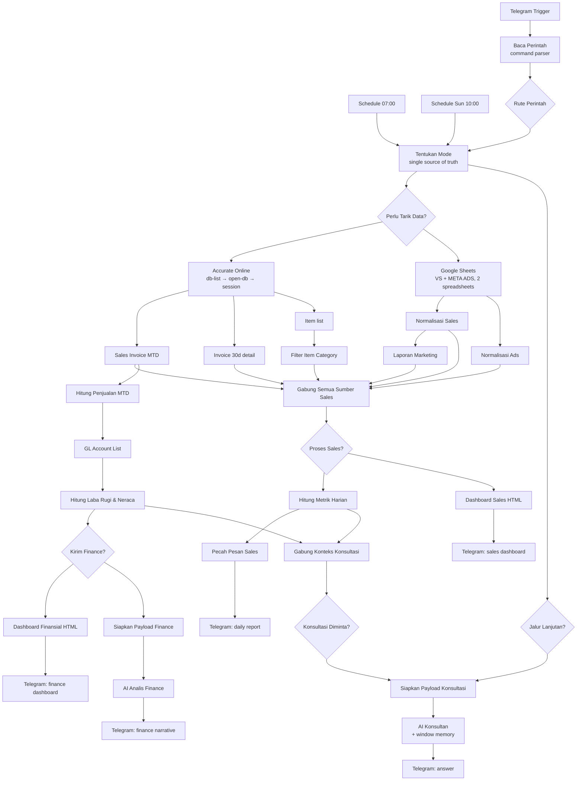

# Daily Sales + Financial Reporting Pipeline (n8n)

An automated reporting system built in **n8n** for an Indonesian modest-menswear
brand selling across Shopee, TikTok Shop, Lazada, Desty and offline channels.

One workflow, 61 nodes, three entry points. Every morning it pulls invoices,
inventory and the chart of accounts out of **Accurate Online**, merges them with
the team's **Google Sheets** sales and Meta Ads trackers, computes the operational
and financial metrics, renders self-contained HTML dashboards, and delivers
everything to **Telegram** as a formatted message plus an attached dashboard file.
The same pipeline doubles as a conversational analyst: `/aiconsult <question>`
answers free-form business questions against the freshly computed numbers.

> **This is a sanitized portfolio copy.** Credentials, spreadsheet IDs, chat IDs
> and webhook IDs have been replaced with placeholders, and the client's name,
> storefronts and product lines have been pseudonymised. See
> [Anonymisation](#anonymisation) below.

---

## What it replaces

Before: someone opened Accurate Online, exported invoices, cross-checked two
spreadsheets, hand-built a recap, and pasted it into the owner's Telegram — daily
for sales, weekly for finance.

After: the recap arrives at 07:00 WIB on its own, the financial pack arrives Sunday
at 10:00, and the owner can ask follow-up questions in the same chat.

| Report | Trigger | Output |
| --- | --- | --- |
| Daily operations | Schedule 07:00 WIB, or `/sales` | Telegram text (auto-chunked) + HTML dashboard file |
| Weekly financials | Schedule Sunday 10:00 WIB, or `/finance` | AI narrative + HTML financial dashboard file |
| Ad-hoc analysis | `/aiconsult <question>`, then plain replies | Conversational answer with memory |

---

## Architecture



Full walkthrough: **[docs/architecture.md](docs/architecture.md)**.

### The one design decision that holds it together

All three entry points converge on a single Code node, `Tentukan Mode`, which is
the **only** place that decides *what gets computed* and *what gets sent*. Every
downstream gate reads flags from it instead of re-deriving schedule or weekday
logic. That separation is what lets `/aiconsult` reuse the sales and finance
branches for context without also firing off their Telegram messages.

---

## Engineering highlights

- **Compute/send split.** `prosesSales` and `kirimSales` are separate flags, so a
  branch can run for its data without its report being delivered. Financial
  calculations deliberately run on *every* execution to keep the daily balance
  snapshot alive; only delivery is gated.
- **Leaf-account accounting.** P&L totals are summed from leaf GL accounts rather
  than parent balances. Accurate's parent `6000` balance silently excluded an
  owner-draw account, overstating net profit and breaking the balance-sheet
  identity; summing leaves closes it to zero.
- **Baseline snapshots for a date-blind endpoint.** `glaccount/list.do` has no date
  filter, so month-to-date deltas are derived from daily balance snapshots kept in
  `$getWorkflowStaticData` — which only persists on production executions.
- **Per-sheet column fingerprinting.** The team starts a new spreadsheet each
  period with its own column numbering. `Normalisasi Sales` groups rows by the set
  of block headers each row carries, so a September row is never read through a
  July column map. Adding a month means adding a Sheets node, not editing code.
- **Indonesian number and date parsing.** `.` as a thousands separator, mixed
  `DD/MM/YYYY` / `D-Mon` / `M/D/YYYY` dates, Excel serial dates, `#DIV/0!` cells,
  forward-fill of dates within campaign groups.
- **Telegram-safe rendering.** Messages are chunked at 3,800 chars on paragraph →
  line → hard-cut boundaries with `(1/3)` markers. HTML output is restricted to the
  four tags Telegram's strict parser accepts, enforced in the AI system prompts.
- **Script-free dashboards.** Tab navigation in the HTML dashboards uses radio
  inputs plus CSS, because Telegram's in-app document viewer does not execute
  JavaScript. No external libraries, no CDN — one portable file.
- **Never-empty outputs.** Every metric has a fallback source, and when data really
  is missing the report prints the reason instead of a bare zero. The finance
  payload puts `dataQuality` first so the model reads the caveats before the
  numbers.
- **Graceful degradation.** Accurate HTTP nodes use `onError: continueRegularOutput`
  with `retryOnFail` (3 tries), so one failed endpoint never aborts a whole report.

More war stories: **[docs/engineering-notes.md](docs/engineering-notes.md)**.

---

## Stack

| Layer | Tool |
| --- | --- |
| Orchestration | n8n (self-hosted), 61 nodes, `executionOrder: v1` |
| ERP / accounting | Accurate Online REST API (OAuth2 + `X-Session-ID`) |
| Spreadsheets | Google Sheets API (OAuth2) |
| LLM | OpenAI chat model via LangChain nodes + window-buffer memory |
| Delivery | Telegram Bot API (message + document) |
| Logic | ~4,000 lines of JavaScript across 15 Code nodes |

---

## Repository layout

```
workflow/
  daily-financial-report.workflow.json   Importable, sanitized n8n export
src/
  code-nodes/*.js                        Each Code node's JS, extracted for review
  prompts/*.md                           AI agent system + user prompts
docs/
  architecture.md                        Flow, modes, gates, data sources
  node-reference.md                      All 61 nodes, grouped and glossed
  setup.md                               How to import and run it yourself
  engineering-notes.md                   API constraints and hard-won gotchas
```

The files under `src/` are extracted **from** the workflow JSON for readability —
the JSON is the source of truth. See [docs/setup.md](docs/setup.md).

---

## Running it

1. Import `workflow/daily-financial-report.workflow.json` into n8n.
2. Create the four credentials and attach them (the export carries placeholder IDs).
3. Replace the `SPREADSHEET_ID_PERIOD_*` placeholders and `YOUR_TELEGRAM_CHAT_ID`.
4. Activate the workflow — `$getWorkflowStaticData` snapshots only persist on
   production executions.

Step-by-step: **[docs/setup.md](docs/setup.md)**.

---

## Anonymisation

This repo is published as a portfolio piece: it shows the engineering, not the
business. The following were replaced:

| Original | Published as |
| --- | --- |
| Client brand name | `BrandCo` |
| Marketplace storefronts | `Shopee Store A/B`, `Tiktok Store`, `Lazada Store` |
| 23 product lines | NATO-alphabet pseudonyms (`Alfa`, `Bravo`, …) |
| Google Spreadsheet IDs | `SPREADSHEET_ID_PERIOD_1` / `_2` |
| Telegram chat ID | `YOUR_TELEGRAM_CHAT_ID` |
| n8n credential IDs | Named placeholders |
| Webhook and node IDs | Stripped (n8n regenerates on import) |

Chart-of-account numbers are kept as-is: they are Accurate's default numbering and
are meaningless without access to the company file. No figures, invoices or
customer records are included anywhere in this repository.

Node names and code comments are in **Indonesian**, as written for the client's
team. [docs/node-reference.md](docs/node-reference.md) glosses every one of them.

---

## License

[MIT](LICENSE) — the automation logic. Not affiliated with n8n, Accurate, Google,
OpenAI or Telegram.
